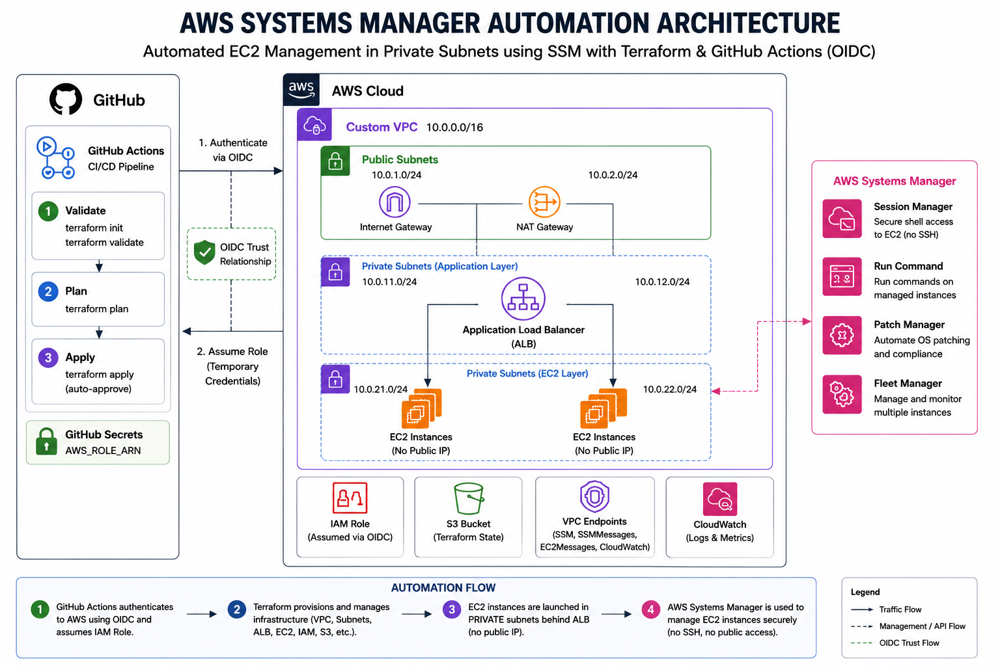

# AWS Systems Manager Linux Automation

Automated EC2 fleet management using AWS Systems Manager, Terraform, and GitHub Actions with OIDC authentication. EC2 instances run in private subnets with no SSH access — all configuration and management is handled through SSM.



---

## Overview

This project provisions and manages a fleet of 5 Amazon Linux 2023 EC2 instances behind an Application Load Balancer. Instead of SSH or user data scripts, **AWS Systems Manager Run Command** installs and configures Apache on every instance automatically after launch. The entire infrastructure is deployed through a GitHub Actions CI/CD pipeline using keyless OIDC authentication to AWS.

---

## Architecture

| Layer | Resource | Details |
|---|---|---|
| Network | Custom VPC | 10.0.0.0/16, 2 public + 2 private subnets across 2 AZs |
| Ingress | Application Load Balancer | Internet-facing, public subnets, port 80 |
| Compute | 5 x EC2 (t2.micro) | Private subnets, no public IP, no SSH key |
| Outbound | NAT Gateway | Allows private EC2s to reach SSM endpoints and install packages |
| Management | AWS Systems Manager | Run Command, State Manager, Patch Manager, Inventory, Fleet Manager |
| Logging | S3 + CloudWatch | SSM command output, Apache logs, patch logs |
| Security | IAM + OIDC | Least-privilege roles, GitHub Actions authenticates via OIDC (no static credentials) |

### Traffic Flow

```
Internet → ALB (public subnet) → EC2 instances (private subnet)
GitHub Actions → OIDC → AWS STS → Temporary credentials → Terraform
SSM Agent (EC2) → NAT Gateway → SSM Endpoints → Run Command / Patch / Inventory
```

---

## What SSM Installs on Every EC2 Instance

The `LinuxAutomation-Install-Apache` SSM document runs automatically on all instances via State Manager association and performs:

1. **OS Update** — `dnf update -y`
2. **Apache** — installs, enables, and starts `httpd`
3. **Firewall** — opens ports 80 (HTTP) and 443 (HTTPS) via `firewalld`
4. **Admin user** — creates `cloudadmin` with sudo (`wheel` group)
5. **App directory** — `/var/www/internal-app/` owned by `cloudadmin:apache`
6. **HTML page** — dynamically generated with live instance metadata (Instance ID, Hostname, Private IP, AZ, Deploy Time) fetched via IMDSv2
7. **Validation** — confirms Apache is active, firewall rules are applied, and localhost returns HTTP 200

No SSH. No user data. No manual steps.

---

## Project Structure

```
.
├── aws-ssm-automation-architecture.png   # Architecture diagram
├── .github/
│   └── workflows/
│       └── terraform.yml                 # CI/CD pipeline (validate / plan / apply)
├── environments/
│   └── prod/
│       ├── main.tf                       # Root module — wires all modules together
│       ├── variables.tf                  # Input variables with defaults
│       ├── outputs.tf                    # ALB DNS, instance IDs, SSM links
│       ├── providers.tf                  # AWS provider + S3 remote backend
│       └── terraform.tfvars.example      # Example variable values
└── modules/
    ├── vpc/                              # Custom VPC, subnets, IGW, NAT Gateway
    ├── iam-ssm/                          # EC2 instance profile for SSM
    ├── security-groups/                  # ALB and EC2 security groups
    ├── ec2-fleet/                        # 5 EC2 instances, IMDSv2, encrypted volumes
    ├── alb/                              # Internet-facing ALB, target group, HTTP listener
    ├── systems-manager/                  # SSM document + State Manager association
    ├── patch-manager/                    # Patch baseline, maintenance window, IAM role
    ├── inventory/                        # SSM Inventory association
    ├── cloudwatch/                       # CloudWatch log group
    └── s3-logs/                          # S3 bucket for SSM and ALB logs
```

---

## CI/CD Pipeline

The GitHub Actions workflow (`.github/workflows/terraform.yml`) is triggered manually via `workflow_dispatch` with three selectable actions:

| Action | What it does |
|---|---|
| `validate` | Runs `terraform init -backend=false` and `terraform validate` |
| `plan` | Authenticates to AWS via OIDC, inits with S3 backend, runs `terraform plan` |
| `apply` | Runs plan then `terraform apply -auto-approve` (requires `production` environment approval) |

### Authentication

GitHub Actions authenticates to AWS using **OIDC** — no static AWS credentials stored anywhere. The workflow assumes an IAM role via `sts:AssumeRoleWithWebIdentity`.

**Required GitHub Variable** (Settings → Variables → Actions):

| Variable | Value |
|---|---|
| `AWS_ROLE_ARN` | `arn:aws:iam::<account-id>:role/GitHubActions-Prod-Deployment-Role` |

### IAM Role Trust Policy

The role must trust GitHub Actions OIDC with a wildcard subject to cover both branch-based and environment-based jobs:

```json
{
  "Version": "2012-10-17",
  "Statement": [
    {
      "Effect": "Allow",
      "Principal": {
        "Federated": "arn:aws:iam::<account-id>:oidc-provider/token.actions.githubusercontent.com"
      },
      "Action": "sts:AssumeRoleWithWebIdentity",
      "Condition": {
        "StringEquals": {
          "token.actions.githubusercontent.com:aud": "sts.amazonaws.com"
        },
        "StringLike": {
          "token.actions.githubusercontent.com:sub": "repo:Shah-CloudEng/aws-systems-manager-terraform-automation:*"
        }
      }
    }
  ]
}
```

---

## Modules

### `vpc`
Creates a fully isolated network with no dependency on pre-existing infrastructure:
- VPC `10.0.0.0/16` with DNS hostnames enabled
- 2 public subnets (ALB) across `us-east-1a` and `us-east-1b`
- 2 private subnets (EC2) across `us-east-1a` and `us-east-1b`
- Internet Gateway for public subnet outbound
- NAT Gateway + Elastic IP for private subnet outbound (required for SSM agent and `dnf install`)

### `iam-ssm`
Creates the EC2 instance profile `EC2-SSM-WebServer-Profile` with the role `EC2-SSM-WebServer-Role`. Attached policies:
- `AmazonSSMManagedInstanceCore` — allows SSM agent to communicate with the SSM service
- `CloudWatchAgentServerPolicy` — allows publishing logs to CloudWatch
- Custom inline policy — allows writing to the S3 logs bucket

### `security-groups`
- **ALB SG** — allows inbound 80/443 from `0.0.0.0/0`, all outbound
- **EC2 SG** — allows inbound port 80 from ALB SG only (no direct internet access), all outbound

### `ec2-fleet`
Launches 5 `t2.micro` Amazon Linux 2023 instances:
- Placed in private subnets (round-robin across AZs)
- IMDSv2 required (`http_tokens = "required"`)
- 30 GB encrypted gp2 root volume
- No SSH key pair, no public IP

### `alb`
- Internet-facing ALB in public subnets
- Target group on port 80 with health check at `/`
- HTTP listener forwarding all traffic to the target group
- All 5 EC2 instances registered as targets

### `systems-manager`
- SSM document `LinuxAutomation-Install-Apache` (JSON Command document)
- State Manager association targeting all instances tagged `Project=LinuxAutomation`
- Runs every 30 minutes, output stored in S3 and CloudWatch

### `patch-manager`
- Patch baseline for Amazon Linux 2023 — Security, Bugfix, Enhancement patches; Critical patches auto-approved immediately
- Maintenance window every Sunday at 2 AM UTC
- Runs `AWS-RunPatchBaseline` with `Install` + `RebootIfNeeded`

### `inventory`
- SSM Inventory association collecting: applications, AWS components, network config, services, instance details
- Runs every 30 minutes

### `cloudwatch`
- Log group `/ssm/LinuxAutomation` with 7-day retention

### `s3-logs`
- Encrypted S3 bucket for SSM command output, patch logs, and ALB access logs
- Versioning enabled, lifecycle policy transitions to S3-IA after 30 days

---

## Accessing the Application

After a successful `apply`, the ALB DNS name is printed as an output. Open it in a browser using HTTP:

```
http://<alb-dns-name>.us-east-1.elb.amazonaws.com
```

Each refresh may show a different Instance ID and private IP as the ALB routes to different instances across the fleet.

---

## Key Design Decisions

**No SSH** — EC2 instances have no key pair and no SSH security group rule. All access is via SSM Session Manager.

**No user data** — Instances launch clean. Apache is installed after launch by SSM State Manager, demonstrating that SSM can manage instances at any point in their lifecycle, not just at boot.

**Private subnets only for EC2** — Instances have no public IP. Only the ALB is internet-facing. SSM agent reaches AWS endpoints through the NAT Gateway.

**OIDC over IAM keys** — GitHub Actions never stores AWS credentials. Short-lived tokens are issued per workflow run via the OIDC trust relationship.

**Remote state** — Terraform state is stored in an encrypted, versioned S3 bucket so any team member or CI run works from the same state.

---

## Tags Applied to All Resources

| Tag | Value |
|---|---|
| `Project` | `LinuxAutomation` |
| `Environment` | `Capstone` |
| `ManagedBy` | `SSM` |
| `Owner` | `DevOps-Team` |

---

## Requirements

| Tool | Version |
|---|---|
| Terraform | >= 1.8.0 |
| AWS Provider | ~> 5.0 |
| AWS CLI | Any recent version |
| GitHub Actions | ubuntu-latest runner |
